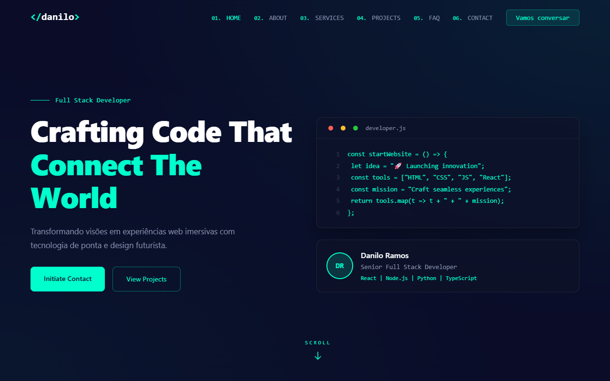

<!-- © 2026 Danilo Ramos | daniloramos.dev.br | Todos os direitos reservados. -->

<h1 align="center">
  <code>&lt;/&gt; danilo</code>
</h1>

<h3 align="center">Desenvolvedor Full Stack</h3>

<p align="center">
  Portfólio pessoal de <b>Danilo Ramos</b>
</p>

> **Portfólio pessoal de Danilo Ramos** — Desenvolvedor Full Stack
>
> Um site one-page futurista construído com **React**, **Vite** e **Tailwind CSS**, com tema dark neon, animações de scroll reveal e formulário de contato integrado com **EmailJS**.

<p align="center">
  <a href="https://chefinhoo.github.io/page-pessoal/">🔗 ver publicação</a>
  ·
  <a href="#sobre">sobre</a>
  ·
  <a href="#tecnologias">tecnologias</a>
  ·
  <a href="#como-rodar">como rodar</a>
  ·
  <a href="#publicar-no-github-pages">publicar</a>
  ·
  <a href="#personalizacao">personalização</a>
</p>

## ✨ Sobre

Site pessoal/portfólio com seções de **Home**, **Sobre**, **Serviços**, **Projetos**, **FAQ** e **Contato**, construído com estética de "terminal de código" (fonte Consolas, acentos em verde neon `#00ffcc`).

| Seção | Conteúdo |
| --- | --- |
| 🏠 Home | Hero com animação, card de perfil e bloco de código animado |
| 👤 Sobre | Bio, estatísticas e barras de skills |
| 🛠️ Serviços | Cards com os serviços oferecidos |
| 📁 Projetos | Grid de projetos com filtros por categoria |
| ❓ FAQ | Perguntas frequentes em acordeão |
| ✉️ Contato | Formulário integrado com EmailJS + links sociais |

## 🛠️ Tecnologias

- **React 19** — interface
- **Vite 8** — build e dev server
- **Tailwind CSS 4** — utilitários de estilo
- **EmailJS** — envio do formulário de contato sem backend
- **Oxlint** — lint rápido (React + Oxc)

## 📂 Estrutura

```
├── public/
│   ├── favicon.ico        # favicon
│   ├── favicon.png        # icone
│   ├── logo.png           # logo
│   └── .htaccess          # apenas p/ hospedagem Apache (domínio próprio)
├── src/
│   ├── App.jsx            # toda a página (seções e dados editáveis)
│   ├── App.css            # estilos legados (vazio)
│   ├── index.css          # estilos globais + classes customizadas
│   ├── main.jsx           # entrada do React
│   └── emailjsConfig.js   # credenciais do EmailJS
├── index.html             # meta tags e título da página
├── vite.config.js         # configuração do Vite
└── package.json           # dependências e scripts
```

## 🖼️ Screenshot

<p align="center">
  <em>Versão desktop</em>
  <br />
  
</p>


## 🚀 Como rodar

```bash
# instalar dependências
npm install

# ambiente de desenvolvimento
npm run dev

# build de produção (domínio próprio, ex.: daniloramos.dev.br)
npm run build

# build para GitHub Pages (url /page-pessoal/)
npm run build:gh

# preview do build
npm run preview

# lint
npm run lint
```

## 🌐 Publicar no GitHub Pages

Veja o guia completo em **[@PASSO_A_PASSO.md](PASSO_A_PASSO.md)**. Resumo rápido:

1. Crie o repositório `chefinhoo/page-pessoal` no GitHub (esse repositório mantém o App já configurado com **GitHub Actions**, arquivo `.github/workflows/deploy.yml` que publica automaticamente em `https://chefinhoo.github.io/page-pessoal/`).
2. Em **Settings → Pages**, escolha *Source: GitHub Actions*.
3. Faça push da branch `main` e o deploy é automático a cada commit.

> O App usa âncoras `#hero`, `#about`, etc. — funcional no GitHub Pages sem configurações extras de SPA.

## 🎨 Personalização

Tudo que precisa ser editado está concentrado em `src/App.jsx` e `src/index.css`:

- **Nome, bio e textos** — seções `About`, `Hero` e arrays de dados no topo do `App.jsx`
- **Skills & níveis** — array `skills` (título, nível `%`, tecnologias)
- **Serviços** — array `services`
- **Projetos** — array `projects` (título, descrição, tags, categoria e emoji)
- **FAQ** — array `faqData`
- **Links sociais** — array `socials` (GitHub, LinkedIn, X, Email)
- **Email de contato** — `mailto:` no `Contact`/`Footer` e `src/emailjsConfig.js` (Service ID, Template ID e Public Key do [EmailJS](https://www.emailjs.com))
- **Cores e tema** — variáveis e classes em `src/index.css` (acento `#00ffcc`)
- **Título e meta tags** — `index.html` (logo, favicon e descrição de SEO)

---

<p align="center">
  <sub>
    © 2026 <b>Danilo Ramos</b> · <a href="https://daniloramos.dev.br">daniloramos.dev.br</a> · Todos os direitos reservados.
  </sub>
</p>
